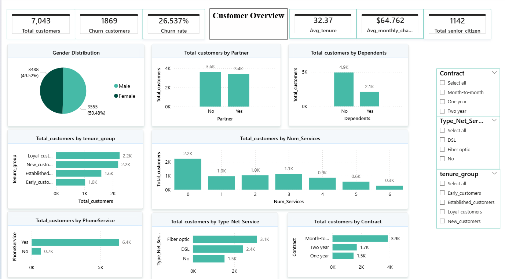
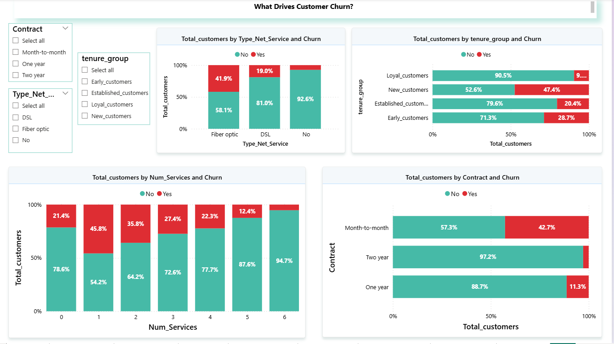
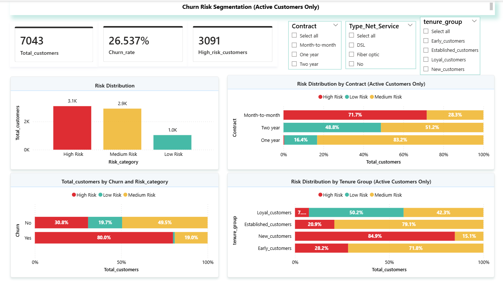

# 📊 Customer Churn Analysis & Risk Segmentation using Power BI

## 📌 Project Description
End-to-end Power BI project focused on customer churn analysis, identifying key drivers, and building a rule-based risk segmentation for proactive retention.

This project analyzes customer churn in a telecom dataset using Power BI and follows a structured analytical approach including:
- Descriptive Analysis  
- Diagnostic Analysis  
- Predictive Analysis  
- Prescriptive Analysis  

The goal is to identify key churn drivers, segment customers based on risk levels, and provide actionable insights to improve customer retention.

---

## 🎯 Key Objectives
- Understand overall customer churn patterns  
- Identify factors influencing churn  
- Segment customers into high, medium, and low risk  
- Enable targeted retention strategies  

---

## 🛠️ Tools & Technologies
- Power BI  
- DAX  
- Power Query  
- Data Modeling  

---

## 📸 Dashboard Preview

### 🔹 Customer Overview

### 🔹 Churn Drivers

### 🔹 Risk Segmentation

---

## 📊 Key Insights
- Month-to-month contracts show higher churn  
- Customers with fewer services are more likely to churn  
- Electronic check users have higher churn risk  
- Fiber optic users exhibit higher churn patterns  

---

## 🎥 Project Walkthrough
Watch the full video explanation here:  
👉 [LinkedIn Video](https://www.linkedin.com/posts/lahari-tummala-6a5664214_powerbi-dataanalytics-churnanalysis-ugcPost-7456692706057306114-ypwI?utm_source=share&utm_medium=member_android&rcm=ACoAADYzzN0B1sCwvuI1lR_EDK01uu3sNzbsNWs)

---

## 📁 Repository Contents
- Power BI Report (.pbix file)  
- Dataset (if included)  
- Screenshots of dashboards  
- README documentation  
